# How the phase-precession pipeline works — from ACG theta epochs to the final class

This document walks through **everything `ThetaMod_PhasePrec_v19_ArenaSesCompare.py` does to one
unit after the ACG theta-epoch selection**, up to the moment the unit is labelled
**phase precessing**, **phase succeeding** (the code also calls this *recessing* or *procession*),
**phase locked**, or **no phase relation**. It covers every number stored along the way.

All figures come from [`Explain_PhasePrecession_Pipeline.py`](../Explain_PhasePrecession_Pipeline.py).
That script **simulates** a small session (a rodent running laps on a 100 × 30 cm runway and sometimes
pausing at an end, theta in the LFP while running and delta while paused) with five model cells whose
behaviour is designed in advance. It then runs **your pipeline's own functions, imported unchanged**,
on that data, so every number in the figures is what the real pipeline would report.

| Model cell | What it was designed to do | What the pipeline concluded |
|---|---|---|
| **A** | precess, −300°/pass | **phase_precessing**, slope −256°/pass |
| **B** | succeed, +120°/pass | **phase_succeeding**, slope +101°/pass |
| **C** | stay almost locked, with a tiny consistent drift of −14°/pass, many spikes | **phase_locked**, slope −8°/pass, p = 2.8 × 10⁻⁵ |
| **D** | perfectly locked at 200°, no drift at all | **no_phase_relation** (p = 0.15) ← see §10 |
| **E** | no theta modulation | stopped at Gate 1 (TMI p = 0.36), never tested |

Cell **A** is the "walk-through cell" in most figures. To regenerate everything:

```
python Explain_PhasePrecession_Pipeline.py      (run from the Codes folder)
```

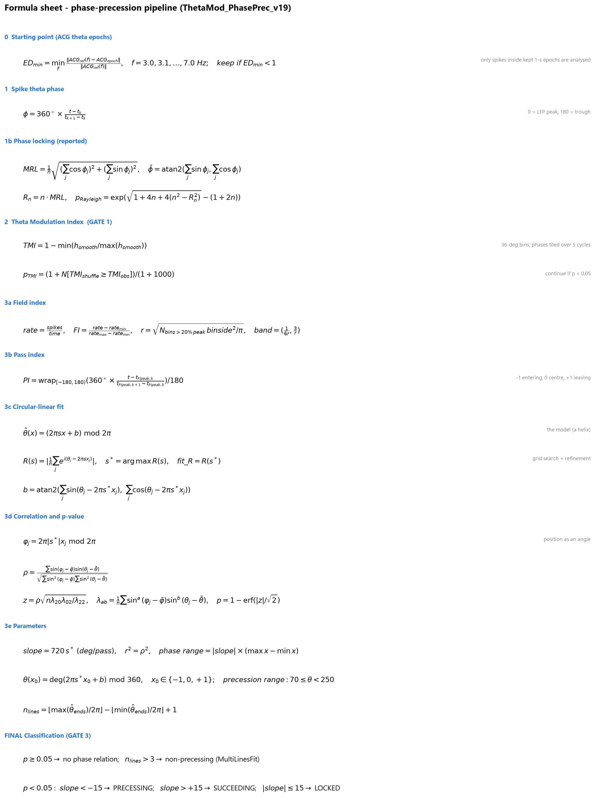
*All formulas on one page (fig12). The sections below explain each one.*

---

## 0. The big picture

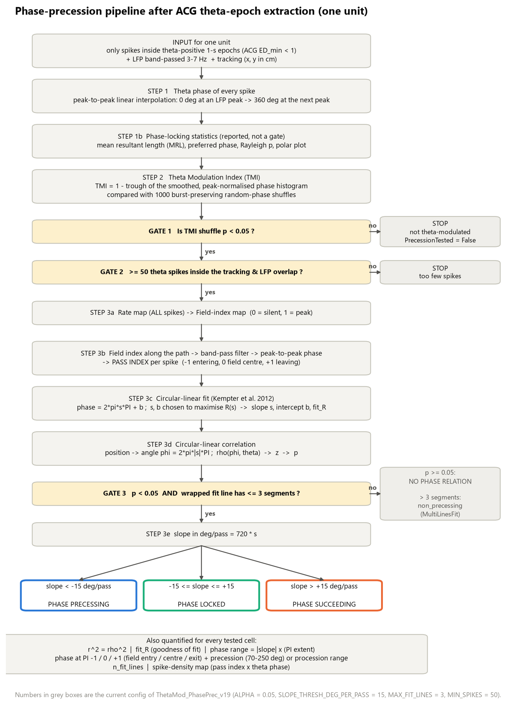

For every unit the pipeline asks three questions, in order:

1. **Does this cell care about theta at all?** (Steps 1–2, ending in *Gate 1*)
   If it fires equally at every theta phase, there's nothing to precess, so it stops here.
2. **Where in its place field is the animal at every spike?** (Steps 3a–3b, the *pass index*)
3. **As the animal moves through the field, does the spike's theta phase shift in a consistent
   direction?** (Steps 3c–3e, the *circular-linear fit*, ending in *Gate 3* and the slope rule)

Symbols used throughout:

| Symbol | Meaning | Type |
|---|---|---|
| $t$ | time of a spike | linear |
| $\phi$ or $\theta$ | **theta phase** of a spike (0° = LFP peak, 180° = trough) | **circular** (wraps at 360°) |
| $x$ or PI | **pass index** of a spike: −1 entering, 0 field centre, +1 leaving | linear |
| $s$ | slope of the fitted line, in **cycles per unit of pass index** | linear |
| $b$ | intercept of the fitted line = theta phase at PI = 0 | circular |
| $\varphi$ | position converted to an angle, $2\pi\lvert s\rvert x$ (used only for the correlation) | circular |
| $n$ | number of spikes | — |

> The code uses the word *theta* for two different things. In `anglereg` / `kempter_lincirc`,
> `theta` is simply "the angle" (the spike's phase). In the rest of the code, *theta* means the
> 3–7 Hz hippocampal rhythm. This document uses $\theta$ / $\phi$ for the spike phase.

---

## 1. Starting point: the spikes that survive the ACG theta-epoch test

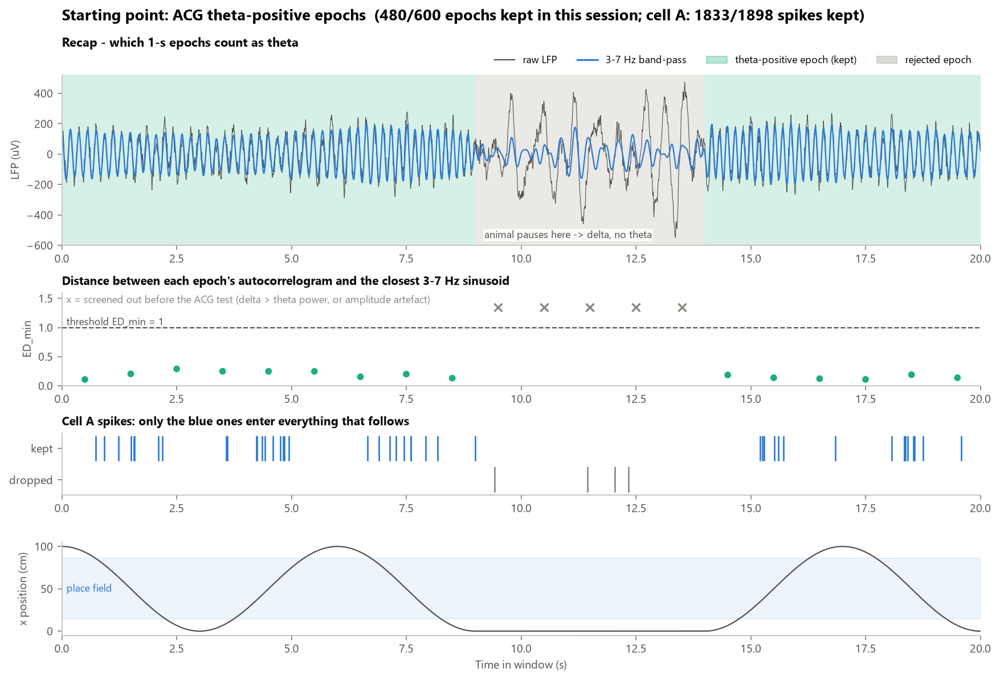

This step happened earlier; here's a short recap so the rest makes sense.

* The LFP is cut into **1-second epochs**.
* Epochs are first screened out if **delta power (1–3 Hz) > theta power (3–7 Hz)** or if their
  peak-to-peak amplitude is an extreme outlier (a robust MAD test, which catches artefacts).
* For each remaining epoch the **autocorrelogram (ACG)** is compared with the ACGs of pure sine waves from
  3.0 to 7.0 Hz in 0.1 Hz steps. The closest match gives
  $$ED_{min} = \min_f \frac{\lVert ACG_{ref}(f) - ACG_{epoch}\rVert}{\lVert ACG_{ref}(f)\rVert}$$
  where 0 means "a perfect sinusoid". An epoch is **theta-positive if $ED_{min} < 1$**.
* **Only spikes inside theta-positive epochs** are used from now on for phase, TMI and precession.
  The **rate map / place field still uses all spikes**, so the field is not distorted by the selection.

In the simulation 480/600 epochs passed and cell A kept 1833 of its 1898 spikes. The spikes it lost
are the ones fired while the animal paused at the end of the track (grey epochs).

---

## 2. Step 1 — giving every spike a theta phase

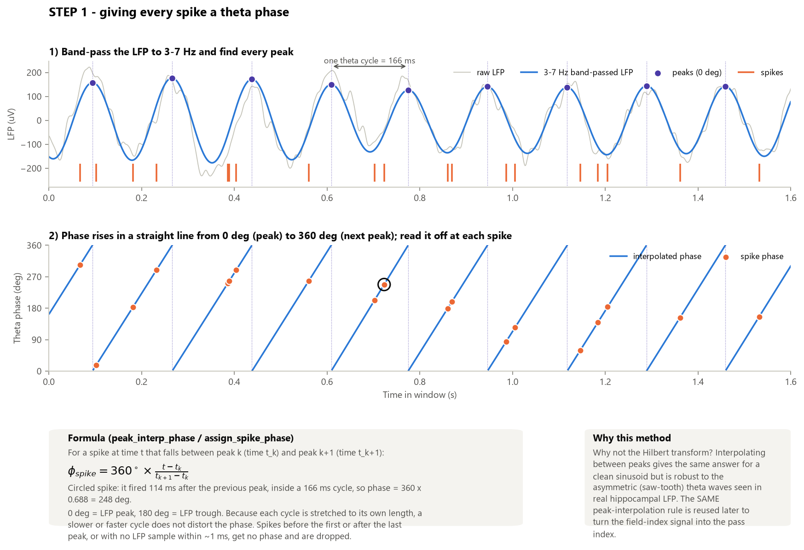

**What is done** (`bandpass_filter`, `peak_interp_phase`, `assign_spike_phase`)

1. The LFP is band-pass filtered to **3–7 Hz** (4th-order Butterworth, run forwards and backwards so
   the filter doesn't shift the timing).
2. **Every peak** of the filtered signal is found.
3. Each peak is called 0°, and the next peak is 360°. In between, the phase rises **in a straight line**.
4. A spike's phase is read off that line:

$$\phi_{spike} = 360^\circ \times \frac{t_{spike} - t_k}{t_{k+1} - t_k}$$

where $t_k$ and $t_{k+1}$ are the peaks before and after the spike.

**Worked example (circled spike in the figure):** it fired 114 ms after the previous peak, in a
cycle that lasted 166 ms, so $\phi = 360 \times 114/166 = 248°$, just past the trough.

**Spikes with no phase.** A spike gets no phase, and is dropped, if it falls before the first or
after the last peak, or if there is no LFP sample within about 1 ms of it (a recording gap).

**Why not the Hilbert transform?** Real theta is often saw-tooth shaped (it rises slowly and falls
quickly). The Hilbert phase then runs unevenly within a cycle. Peak-to-peak interpolation stretches
each cycle to its own length, so a slower or faster cycle doesn't distort the phase.

---

## 3. Step 1b — how strongly does the cell prefer one phase? (reported, not a gate)

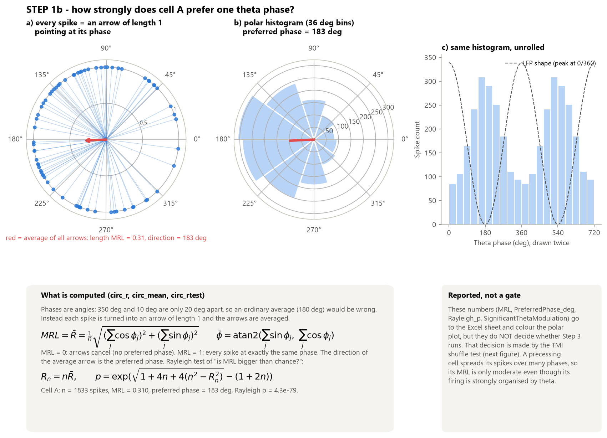

Phases are angles, so they can't be averaged like ordinary numbers: the mean of 350° and 10° is
0°, not 180°. Instead:

* Each spike is drawn as an **arrow of length 1** pointing at its phase (panel a).
* All arrows are **averaged** (added nose-to-tail and divided by $n$).
* The **length** of the average arrow is the **Mean Resultant Length (MRL)**. Its **direction** is the
  **preferred phase**.

$$MRL = \bar R = \frac{1}{n}\sqrt{\Big(\sum_j \cos\phi_j\Big)^2 + \Big(\sum_j \sin\phi_j\Big)^2}
\qquad
\bar\phi = \operatorname{atan2}\Big(\sum_j \sin\phi_j,\ \sum_j \cos\phi_j\Big)$$

* MRL = 0: the arrows cancel out, so there's no preferred phase.
* MRL = 1: every spike fires at exactly the same phase.

**Rayleigh test** ("is the MRL bigger than chance?"), with $R_n = n\bar R$:

$$p_{Rayleigh} = \exp\!\Big(\sqrt{1 + 4n + 4(n^2 - R_n^2)} - (1 + 2n)\Big)$$

Cell A: n = 1833, MRL = 0.31, preferred phase = 183°, Rayleigh p = 4 × 10⁻⁷⁹.

**Important:** these values (`MRL`, `PreferredPhase_deg`, `Rayleigh_p`,
`SignificantThetaModulation`) go into the Excel sheet and colour the polar plot. They do **not**
decide whether Step 3 runs; the TMI test does that. A precessing cell spreads its spikes over many
phases, so its MRL is only moderate (0.31) even though theta clearly organises its firing.
In the other direction, cell E has a tiny MRL of 0.046, yet with 1852 spikes Rayleigh calls it
significant (p = 0.02). The TMI shuffle test does not (p = 0.36). The two tests can disagree.

---

## 4. Step 2 — Theta Modulation Index (TMI) and its shuffle test → GATE 1

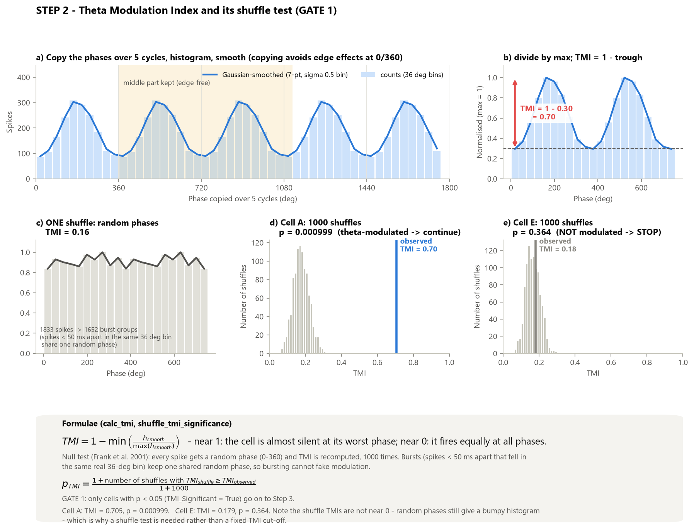

**The TMI** (`calc_tmi`, after Frank et al. 2001) asks: *at the cell's worst phase, how silent is it
compared with its best phase?*

1. **Copy the phases over 5 cycles** (0–1800°). This way the histogram has no artificial edge at 0/360.
2. Make a histogram with **36° bins** and smooth it (7-point Gaussian kernel, σ = 0.5 bin).
3. Keep only the **middle part** (360°–1116°), away from the edges.
4. Divide by the maximum, so the highest bin = 1.
5. $$TMI = 1 - \min\left(\frac{h_{smooth}}{\max h_{smooth}}\right)$$

* TMI near 1: the cell is nearly silent at its worst phase (strong modulation).
* TMI near 0: it fires equally at all phases.

Cell A: trough = 0.30, so TMI = 1 − 0.30 = **0.70**.

**Is that TMI bigger than chance? The shuffle test** (`shuffle_tmi_significance`)

* Each spike is given a **random phase** (0–360°) and the TMI is recomputed. This is repeated
  **1000 times**.
* **Bursts stay together:** consecutive spikes < 50 ms apart that fell in the same real 36° bin get
  **one shared** random phase. A bursty cell therefore can't fake modulation.
* The p-value is the fraction of shuffles that did at least as well as the real data:
  $$p_{TMI} = \frac{1 + \#\{TMI_{shuffle} \ge TMI_{observed}\}}{1 + 1000}$$
  The "+1" stops p from ever being exactly 0, so the smallest possible p is 1/1001 ≈ 0.001.

Notice in panels d/e that the shuffled TMIs are **not near 0**. They sit around 0.1–0.3, because
random phases still give a bumpy histogram. That's why a fixed TMI cut-off would be unreliable and
a shuffle test is needed.

> **GATE 1:** only units with **TMI p < 0.05** (`TMI_Significant = True`) continue.
> Cell A: p = 0.001, so it continues. Cell E: p = 0.36, so it **stops** (`PrecessionTested = False`).

**GATE 2:** the unit also needs **at least 50 theta spikes** inside the time window covered by both
tracking and LFP (`MIN_SPIKES_FOR_FIT`).

---

## 5. Step 3a — from spikes to a field-index map

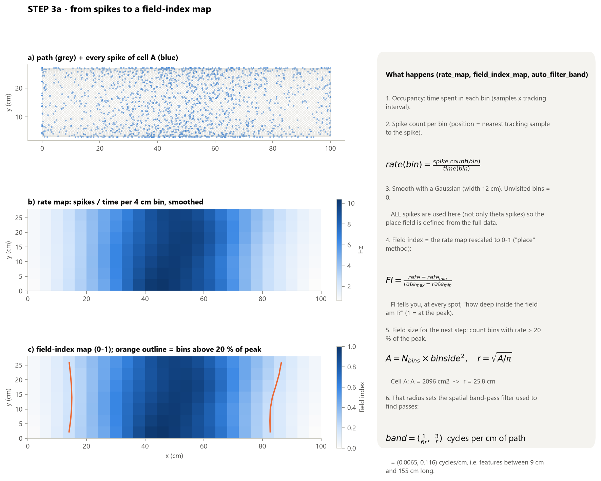

1. **Occupancy:** how long the animal spent in each 4 × 4 cm bin.
2. **Spike count per bin.** Each spike is placed at the nearest tracked position. **All spikes** are
   used here, not only theta spikes.
3. **Rate map:** $rate(bin) = \dfrac{spike\ count(bin)}{time(bin)}$, then Gaussian-smoothed
   (width 12 cm). Bins the animal never visited are set to 0.
4. **Field index (FI):** the rate map rescaled to 0–1 (the `'place'` method):
   $$FI = \frac{rate - rate_{min}}{rate_{max} - rate_{min}}$$
   FI answers "how deep inside the field am I?" at every location (1 = at the peak).
5. **Field size**, needed for the next step: count the bins whose rate is above 20 % of the peak.
   $$A = N_{bins} \times binside^2 ,\qquad r = \sqrt{A/\pi}$$
   Cell A: A = 2096 cm² → r = 25.8 cm.
6. That radius sets a **spatial band-pass filter**:
   $$band = \left(\frac{1}{6r},\ \frac{3}{r}\right)\ \text{cycles per cm of path}$$
   Cell A: (0.0065, 0.116) cycles/cm, which keeps "bumps" between ~9 cm and ~155 cm long.

---

## 6. Step 3b — the PASS INDEX: "how far through the field am I?"

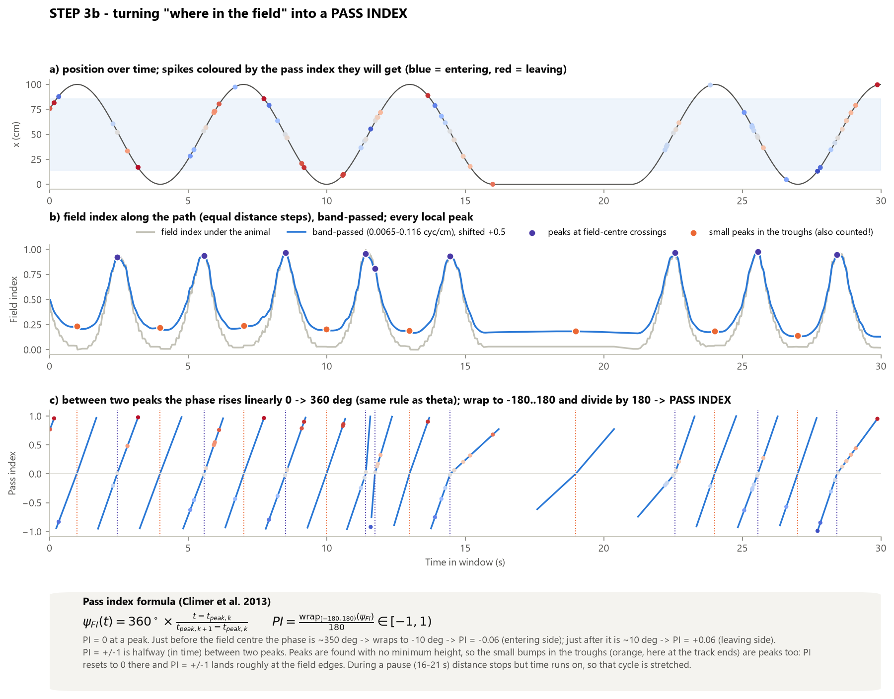

The pass index (Climer et al. 2013) gives every spike a single number from −1 to +1 that says how
far the animal has gone through the current crossing of the field. It works the same way on a
linear track or an open arena.

1. At every tracking sample, read off the **field index under the animal**. Running through the
   field, this rises from ~0 to 1 and falls again: one **bump per pass** (panel b, grey).
2. Resample this signal at **equal steps of distance travelled** (not time), so slow and fast runs
   look alike.
3. **Band-pass filter** it with the band from §5 (panel b, blue).
4. Find **every peak** of the filtered signal and apply **exactly the same peak-to-peak rule as for
   theta** (§2): 0° at a peak, rising linearly (in *time*) to 360° at the next.
5. Wrap to −180…+180° and divide by 180:
   $$PI = \frac{\operatorname{wrap}_{[-180,180)}(\psi_{FI})}{180} \in [-1, 1)$$

So:
* **PI = 0** at a peak, i.e. the field centre.
* Just **before** the centre the phase is ~350°, which wraps to −10°, giving **PI ≈ −0.06 (entering)**.
* Just **after** the centre the phase is ~10°, giving **PI ≈ +0.06 (leaving)**.
* **PI = ±1** is halfway (in time) between two peaks.

**Things to know about this step (visible in the figure):**

* **Every local peak counts.** `find_peaks` is called with no minimum height or prominence. Small
  bumps in the troughs of the filtered signal (orange dots; here they fall at the track ends) are
  peaks too. PI then resets to 0 there as well, and ±1 ends up roughly at the field edges. In this
  simulation that works out well. In real data, a small wiggle *inside* a pass splits that pass into
  two short PI cycles. Look near 11.5 s: two violet peaks close together produce a very short cycle,
  and one spike gets PI ≈ −0.9 although it is near the centre.
* **Pauses stretch a cycle.** The phase rises with *time* between peaks. During a pause (16–21 s) no
  distance is covered but time runs on, so that cycle is long and slow.

---

## 7. Step 3c (the idea) — why "fitting a line" needs special care here

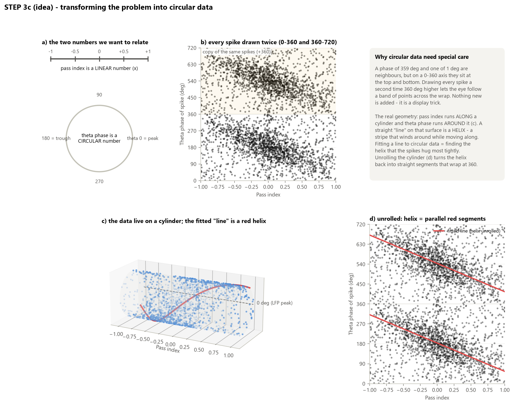

We want to relate a **linear** number (pass index, $x$) to a **circular** number (theta phase, $\theta$).

* **Double plotting (panel b).** 359° and 1° are neighbours, but on a 0–360 axis they sit at the top
  and bottom. Drawing every spike twice (at $\theta$ and $\theta + 360°$) lets the eye follow a band of
  points across the wrap. This is only a display trick; no data are added.
* **The real geometry is a cylinder (panel c).** Pass index runs *along* the cylinder and theta phase
  runs *around* it. A "straight line" on this surface is a **helix**, a stripe that winds around
  while moving along.
* **Fitting a line to circular data = finding the helix the spikes hug most tightly.** Unrolling the
  cylinder (panel d) turns the helix back into straight segments that wrap at 360°.

The model is therefore

$$\hat\theta(x) = (2\pi s x + b)\ \bmod\ 2\pi$$

with **slope $s$ in cycles per unit of pass index** and **intercept $b$** (the phase at PI = 0).

---

## 8. Step 3c — the circular-linear fit (Kempter et al. 2012): finding $s$ and $b$

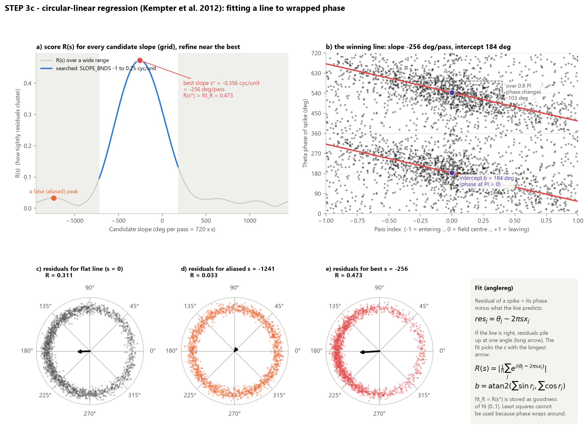

Ordinary least squares can't be used, because phase wraps around: an "error" of 350° is really an
error of −10°. The method instead works with **residuals**.

**Residual** of spike $j$ for a candidate slope $s$ = its phase minus what the line predicts (ignoring
$b$ for now):

$$res_j = \theta_j - 2\pi s x_j$$

* If $s$ is right, all residuals point roughly the **same way** on the circle (panel e: a long arrow).
* If $s$ is wrong, they spread around the circle (panels c, d: short arrows).

So the fit picks the slope that makes the residuals **most concentrated**, i.e. the slope with the
**largest MRL of the residuals**:

$$R(s) = \left|\frac{1}{n}\sum_j e^{\,i(\theta_j - 2\pi s x_j)}\right| ,\qquad s^* = \arg\max_s R(s)$$

**How the code searches** (`anglereg`):

1. $R(s)$ has several bumps ("aliased" peaks, panel a), so a simple optimiser can land on the wrong one.
2. The code therefore tries a **dense grid** of slopes across `SLOPE_BNDS = (−1, 0.25)` cycles/unit,
   i.e. **−720 to +180 °/pass** (blue part of panel a; the grey shading was not searched). There are
   at least 500 grid points.
3. It then **refines** around the best grid point with a bounded 1-D optimiser.

**Intercept:** once $s^*$ is known, $b$ is simply the circular mean of the residuals:

$$b = \operatorname{atan2}\Big(\sum_j \sin(\theta_j - 2\pi s^* x_j),\ \sum_j \cos(\theta_j - 2\pi s^* x_j)\Big)$$

**Goodness of fit:** `fit_R` $= R(s^*)$, from 0 to 1. 1 = every spike on the line; 0 = residuals uniform.

Cell A: $s^* = -0.356$ cycles/unit → **−256°/pass**, $b$ = **184°**, `fit_R` = **0.473**.
Compare with the flat line ($s = 0$), whose R = 0.311: that is just the cell's MRL, which shows the
slope genuinely tightens the residuals.

---

## 9. Step 3d — is the relationship real? Correlation $\rho$ ("phi") and its p-value

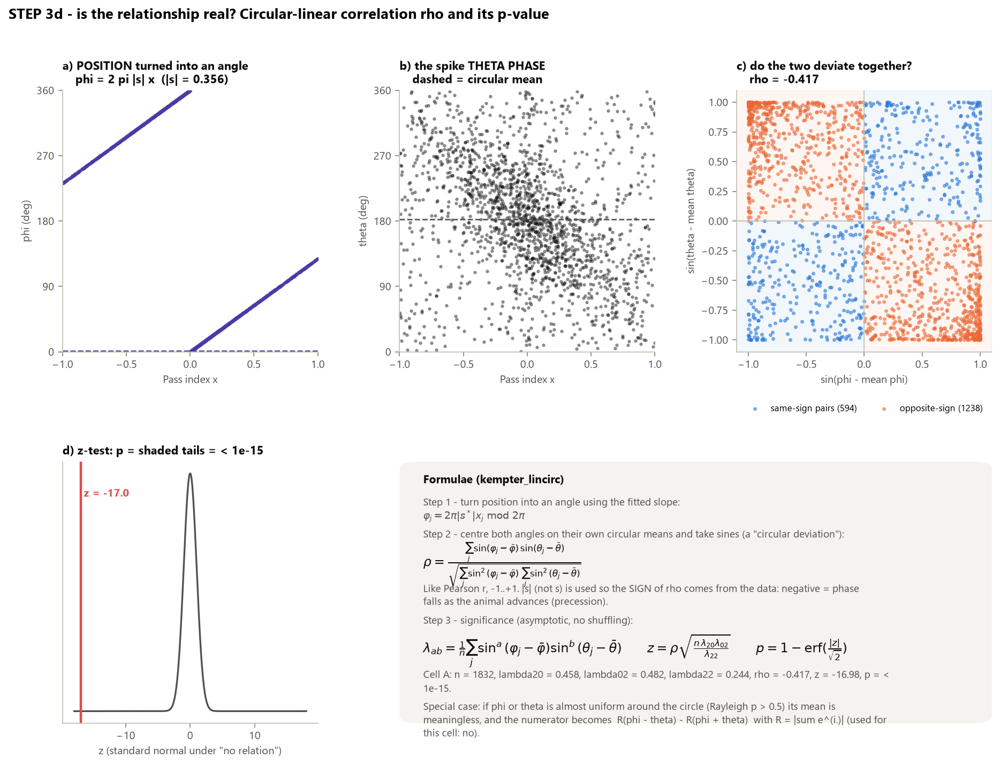

A good fit isn't enough. Even random data have *some* best slope. Kempter's circular-linear
correlation measures how strongly phase and position **vary together**.

**Step 1: turn position into an angle ("phi")** using the fitted slope:

$$\varphi_j = 2\pi\,\lvert s^*\rvert\, x_j \ \bmod\ 2\pi$$

The code uses $\lvert s^*\rvert$ (not $s^*$), so the **sign of $\rho$ comes from the data**:
negative means the phase falls as the animal moves forward (precession).

**Step 2: circular deviations.** Centre each angle on **its own** circular mean and take the sine:
$\sin(\varphi_j - \bar\varphi)$ and $\sin(\theta_j - \bar\theta)$. These play the role of
"value minus mean" in an ordinary Pearson correlation.

**Step 3: correlation** (panel c: same-sign pairs push $\rho$ up, opposite-sign pairs push it down):

$$\rho = \frac{\sum_j \sin(\varphi_j - \bar\varphi)\,\sin(\theta_j - \bar\theta)}
{\sqrt{\sum_j \sin^2(\varphi_j - \bar\varphi)\ \sum_j \sin^2(\theta_j - \bar\theta)}}
\qquad (-1 \le \rho \le 1)$$

**Special case:** if $\varphi$ or $\theta$ is almost uniform around the circle (Rayleigh p > 0.5),
its circular mean is meaningless. The numerator is then replaced by
$\lvert\sum e^{i(\varphi-\theta)}\rvert - \lvert\sum e^{i(\varphi+\theta)}\rvert$, and the result is
divided by 2 × the same denominator.

**Step 4: significance** (asymptotic z-test, no shuffling):

$$\lambda_{ab} = \frac{1}{n}\sum_j \sin^a(\varphi_j - \bar\varphi)\,\sin^b(\theta_j - \bar\theta)$$

$$z = \rho\,\sqrt{\frac{n\,\lambda_{20}\,\lambda_{02}}{\lambda_{22}}}
\qquad
p = 1 - \operatorname{erf}\!\left(\frac{\lvert z\rvert}{\sqrt 2}\right)$$

Cell A: n = 1832, λ₂₀ = 0.458, λ₀₂ = 0.482, λ₂₂ = 0.244 → **ρ = −0.417**, z = −17.0, **p < 10⁻¹⁵**.
(The pipeline stores p = 0 here. That only means the number is below what a computer can represent.)

---

## 10. Step 3e — the stored parameters

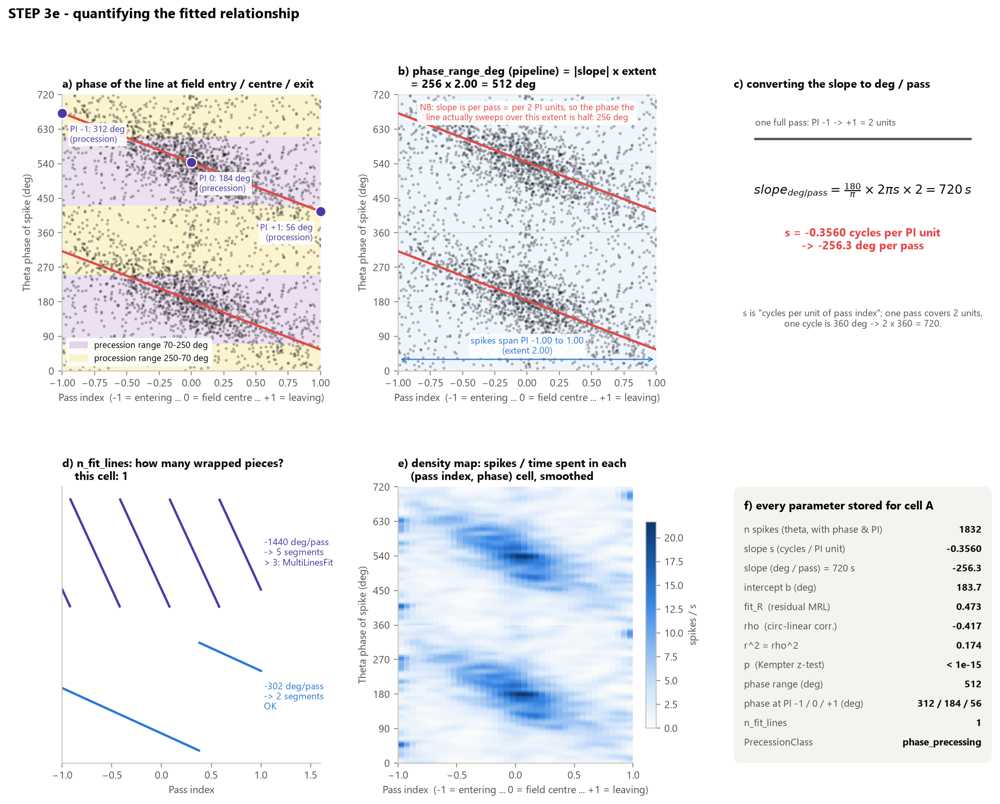

| Column in Excel | Formula | What it means | Cell A |
|---|---|---|---|
| `slope_deg_per_pass` | $720\,s^*$ | phase change over one full pass. $s$ is cycles per PI unit, a pass spans 2 units (−1 → +1), and one cycle is 360°: $360 \times 2 \times s = 720\,s$ | **−256.3** |
| `rho` | §9 | circular-linear correlation (sign = direction) | −0.417 |
| `r_squared` | $\rho^2$ | fraction of "co-variation" explained | 0.174 |
| `precession_p` | §9 | significance of $\rho$ | < 10⁻¹⁵ |
| `fit_R` | $R(s^*)$ | how tightly spikes hug the line (0–1) | 0.473 |
| `phase_at_pim1_deg` | $\deg(2\pi s^*(-1) + b) \bmod 360$ | fitted phase at **field entry** | 312° |
| `phase_at_pi0_deg` | $\deg(b) \bmod 360$ | fitted phase at **field centre** | 184° |
| `phase_at_pip1_deg` | $\deg(2\pi s^*(+1) + b) \bmod 360$ | fitted phase at **field exit** | 56° |
| `phase_at_*_range` | 70 ≤ phase < 250 → `precession`, else `procession` | which half of the cycle that phase falls in | procession / precession / procession |
| `phase_range_deg` | $\lvert slope\rvert \times (\max x - \min x)$ | intended as the "phase actually swept" | 512 ⚠ |
| `n_fit_lines` | $\lfloor \max\hat\theta_{ends}/2\pi\rfloor - \lfloor \min\hat\theta_{ends}/2\pi\rfloor + 1$ | how many wrapped pieces the line makes across the spikes' PI extent | 1 |
| density map | spikes ÷ time in each (PI, phase) bin, smoothed | picture of where in (position, phase) the cell fires | panel e |

Cell A's pattern is the textbook one: it enters firing late in the cycle (312°), fires near the
trough at the field centre (184°), and leaves early in the cycle (56°).

> ⚠ **`phase_range_deg` is 2× too large in the current code.** `slope_deg_per_pass` is already per
> pass, i.e. per **2** units of pass index, so the phase swept over an extent $E$ is
> $\lvert slope\rvert \times E / 2$, not $\lvert slope\rvert \times E$. A cell whose spikes span the
> whole pass (E = 2) should get phase range = |slope| = 256°, not 512°. You can confirm this in fig08
> panel b: over 0.8 PI units the line changes by 103° ≈ 256 × 0.8 / 2. This affects the
> "phase range" arena/session comparisons by a constant factor of 2 (rankings and p-values are
> unchanged, absolute values are doubled). The fix is one line in `compute_pass_index`
> (`... * pass_index_range / 2`).

> ℹ `phase_range_deg` uses the **full** extent of spike pass indices (max − min). One stray spike
> at PI = ±1 stretches the extent to ~2, as happened for cell A.

---

## 11. FINAL — the classification

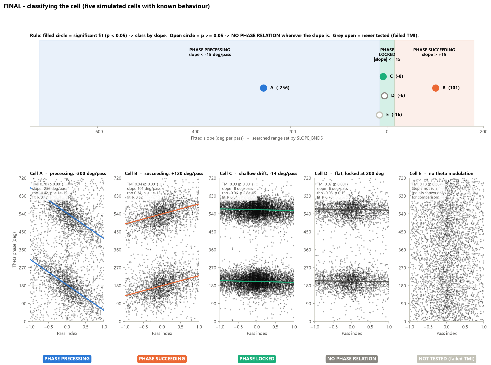

The decision, exactly as coded in `compute_pass_index`:

```
if precession_p is NaN                        -> (no class)
elif n_fit_lines > MAX_FIT_LINES (3)          -> 'non_precessing'   (plot copied to MultiLinesFit)
elif p < 0.05 and slope < -15 deg/pass        -> 'phase_precessing' (is_precessing = True)
elif p < 0.05 and slope > +15 deg/pass        -> 'phase_succeeding' (is_recessing  = True)
elif p < 0.05                                 -> 'phase_locked'     (is_phase_locked = True)
else                                          -> 'no_phase_relation'
```

In words:
1. **Not significant (p ≥ 0.05) → NO PHASE RELATION**, *whatever* the slope is.
2. **Significant and steeply falling (slope < −15°/pass) → PHASE PRECESSING.** The cell fires at
   progressively *earlier* phases as the animal crosses the field.
3. **Significant and steeply rising (slope > +15°/pass) → PHASE SUCCEEDING** (procession). The cell
   fires at progressively *later* phases.
4. **Significant but shallow (|slope| ≤ 15°/pass) → PHASE LOCKED.**

### The five model cells

| | A | B | C | D | E |
|---|---|---|---|---|---|
| designed | −300°/pass | +120°/pass | −14°/pass | 0 (locked at 200°) | no theta |
| TMI (p) | 0.70 (0.001) | 0.94 (0.001) | 0.99 (0.001) | 0.97 (0.001) | 0.18 (0.36) |
| slope (°/pass) | −256 | +101 | −8 | −6 | — |
| ρ | −0.42 | +0.34 | −0.06 | −0.03 | — |
| p | < 10⁻¹⁵ | < 10⁻¹⁵ | 2.8 × 10⁻⁵ | 0.15 | — |
| fit_R | 0.47 | 0.62 | 0.84 | 0.76 | — |
| **class** | **precessing** | **succeeding** | **locked** | **no relation** | **not tested** |

### ⚠ The single most important thing to understand: "phase locked" vs "no phase relation"

Cell **D** is the most perfectly phase-locked cell of all: it always fires at 200° (TMI 0.97,
MRL 0.76). Yet the pipeline calls it **no_phase_relation**. Why?

The correlation $\rho$ (§9) asks *"does the phase **change** with position?"*, not *"is the phase
**concentrated**?"*. A perfectly flat cell has no co-variation between position and phase, so
ρ ≈ 0 and p is not significant. It falls into rule 1.

A cell only ends up as **phase_locked** when there is a *statistically significant but shallow*
slope, like cell **C**: a real −8°/pass drift, detected because it has ~5500 spikes. So in this
pipeline:

* **phase_locked** = "phase shifts a tiny but real amount across the field"
* a classic "fires at the same phase everywhere" cell = **no_phase_relation** with a significant TMI.

When interpreting the counts, "no phase relation" therefore mixes two kinds of cell: theta-locked
cells with a flat line, and cells whose phase is noisy with respect to position. `TMI`, `MRL` and
`fit_R` separate them. A high fit_R with no significant slope means a locked, flat cell.

---

## 12. Other behaviours of the current code worth knowing

1. **Slope threshold:** the module docstring says ±22°/pass, but the active setting is
   `SLOPE_THRESH_DEG_PER_PASS = 15.0`. The figures use 15.
2. **Search range is asymmetric:** `SLOPE_BNDS = (−1, 0.25)` cycles/unit = −720…+180°/pass.
   Succeeding (positive) slopes steeper than **+180°/pass cannot be found**. The fit returns the
   best slope ≤ +180 or jumps to an aliased negative one.
3. **`MaxFitLines` can't trigger with these bounds.** With |s| ≤ 1 and a PI extent < 2, the line spans
   less than 4π, i.e. at most 3 pieces, so `n_fit_lines > 3` (non_precessing / MultiLinesFit) only
   happens if `SLOPE_BNDS` is widened or set to `None`.
4. **Pass-index peaks have no height/prominence threshold** (§6). Small wiggles in the filtered field
   index create extra PI cycles. It's worth looking at a few PassIndex plots for "chopped" passes.
5. **Fitted slopes tend to be shallower than the true ones.** In the simulation every cell was
   recovered at ~60–85 % of its designed slope (−300 → −256, +120 → +101, −14 → −8). Errors in the
   pass index (*x*) blur the relation and flatten the fitted line ("regression dilution"). A real cell
   near the ±15°/pass border can therefore be pushed into "locked".
6. **Rayleigh and TMI can disagree** (cell E: Rayleigh p = 0.02, TMI p = 0.36). Only TMI gates Step 3.
7. **The density map's occupancy** uses only theta-positive LFP samples (`lfp_theta_mask`), matching
   the spikes that enter it.

---

## 13. One-paragraph summary

Each theta-epoch spike gets a theta phase by stretching every LFP cycle between two peaks to 0–360°.
The cell must fire much less at its worst phase than at its best (TMI), more than in 1000
burst-preserving random-phase shuffles; otherwise it stops. The place field is turned into a 0–1
"field index", and the field index the animal experiences along its path is filtered. The same
peak-to-peak trick then gives each spike a pass index from −1 (entering) through 0 (centre) to +1
(leaving). Because phase wraps, the line *phase = 2πs·PI + b* is found by trying every slope and
keeping the one that makes the residual phases most concentrated (largest R, stored as `fit_R`).
Position is then converted to an angle (φ = 2π|s|·PI) and correlated with phase (ρ), and the z-test
gives p. If p ≥ 0.05 the cell has no phase relation. If p < 0.05 the slope (720·s °/pass) decides:
below −15 is **precessing**, above +15 is **succeeding**, and in between is **locked**.
